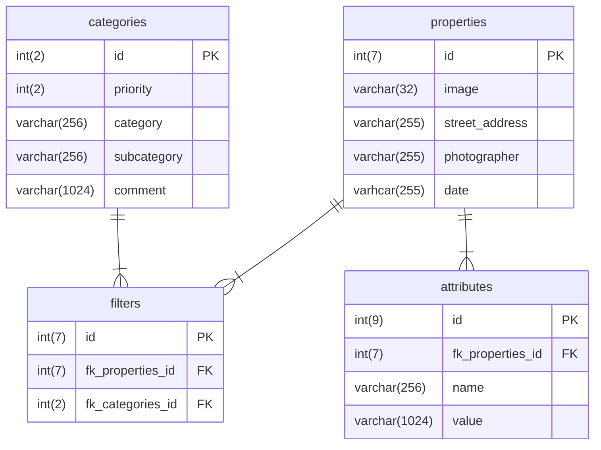

# Browser

A faceted search and navigation web application for browsing cultural heritage image collections. Users select category filters from dropdown menus to narrow results across ~20,000 accession records, view paginated results, and drill into individual accession detail pages.

## Documentation
[Lightning Talk](docs/browser-lightning-talk-20151118.pdf)

## Screenshot


## Features
- **Faceted navigation** with dropdown category filters and checkbox selection
- **Projected result counts** shown as badges next to each unselected filter
- **Pagination** with configurable results per page (`?limit=N`, max 500)
- **Result count display** ("Showing X-Y of Z results")
- **Breadcrumb bar** showing active filters with a "Clear all filters" link
- **Single accession detail pages** with full metadata and attributes
- **WCAG accessibility** with a submit button fallback for screen readers

---

# Technical Details

## Architecture
PHP 5+/8.x application using the [LightVC](modules/lightvc/) MVC framework, Bootstrap 3.x, and jQuery 1.11.3.

```
browser-rewrite/
├── classes/          # Database access, navigation, display, filter logic
├── config/           # Application config, routes, DB credentials
├── controllers/      # Page, Filter, Display, About, Error controllers
├── modules/          # LightVC framework (bundled)
├── tools/            # Database population script
├── views/            # PHP templates and default layout
└── webroot/          # Document root (index.php, css/, js/, images/)
```

### Request flow
```
GET /?filter[]=Category%3ASubcategory&offset=100
  → Apache mod_rewrite → webroot/index.php
    → Lvc_FrontController → Lvc_RegexRewriteRouter
      → PageController::actionView()
        → Navigation: builds dropdown menus + breadcrumbs
        → Display: queries filtered results with pagination
        → View: renders Bootstrap HTML
```

## Database Schema


- **categories** -- navigation dropdown entries, ordered by `priority`
- **filters** -- junction table mapping categories to accessions (properties)
- **properties** -- the 20,000 [randomly generated](tools/populate_database.php) accession records
  - `date` is `varchar` rather than MySQL `date` because source data contains arbitrary date strings (e.g., "Temporal 1900-1909")
- **attributes** -- arbitrary key/value metadata per accession, sorted alphabetically by name

## Setup

### 1. MySQL

Refer to comments in [Database.php](classes/Database.php) for the full schema DDL.

1. Enforce strict mode in `my.cnf`:
   ```ini
   sql_mode="STRICT_ALL_TABLES"
   ```
2. Create the database, users, tables, and indexes:
   - Database: `browser`
   - Users: `browser_www` (SELECT only for the app), plus a user with INSERT for populating data
   - Tables: `categories`, `properties`, `filters`, `attributes`
   - Indexes on `categories`, `filters`, `attributes`

### 2. Populate database

1. Copy [credentials.php-template](tools/credentials.php-template) to `tools/credentials.php` and configure values (user must have INSERT privileges)
2. Run [populate_database.php](tools/populate_database.php) to generate ~20,000 accessions
   - Run this script only once. To re-run, drop and recreate all tables first, as the script depends on auto-increment primary key ordering.

### 3. Apache

Configure a VirtualHost with `DocumentRoot` and `Directory` pointing to `webroot/` (not the top-level project directory), as required by LightVC:

```apache
<VirtualHost *:443>
    ServerName browser.example.com
    DocumentRoot /var/www/browser-rewrite/webroot

    <Directory /var/www/browser-rewrite/webroot>
        AllowOverride All
        Require all granted
    </Directory>

    SSLEngine on
    SSLCertificateFile    /etc/letsencrypt/live/browser.example.com/fullchain.pem
    SSLCertificateKeyFile /etc/letsencrypt/live/browser.example.com/privkey.pem

    ErrorLog  ${APACHE_LOG_DIR}/browser-error.log
    CustomLog ${APACHE_LOG_DIR}/browser-access.log combined
</VirtualHost>
```

#### CDN (optional)

The application references a CDN for placeholder images. To simulate this locally, deploy [Dynamic Dummy Image Generator](http://dummyimage.com/) to a separate VirtualHost:

- `code.php` is required (referenced by its `.htaccess`); `index.php` is not
- Requires PHP GD: `apt-get install php-gd`
- Line 110 of `code.php` may need an explicit font path, e.g.: `$font = "/var/www/cdn/mplus-1c-medium.ttf";`

### 4. Application configuration

1. Copy [config.php-template](config/config.php-template) to `config/config.php`
2. Set the MySQL credentials (`browser_www` with SELECT-only privileges)
3. Set `CDN_URL` to the CDN VirtualHost FQDN

### 5. Rate limiting (recommended)

Install and enable `mod_evasive` for Apache to protect against abusive crawlers and simple DoS:

```bash
apt-get install libapache2-mod-evasive
a2enmod evasive
systemctl restart apache2
```
