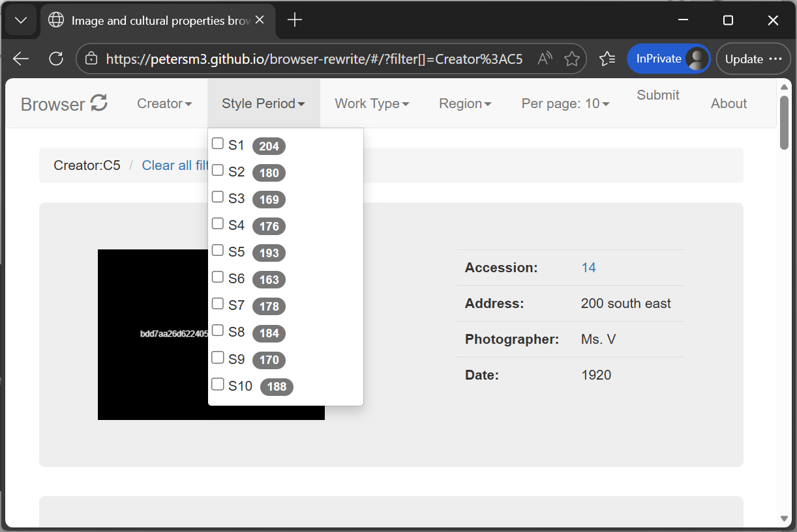
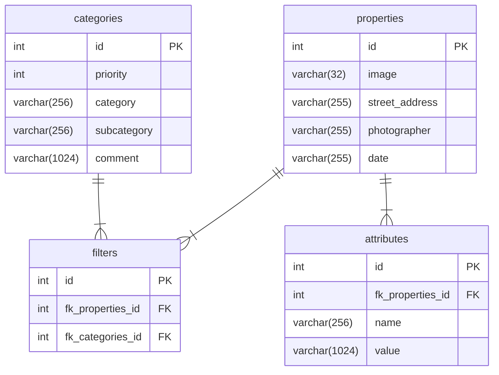

# Browser Rewrite
Image and cultural properties browser rewrite using Claude Code

## Summary

A faceted search and navigation web application for browsing cultural heritage image collections. Users select category filters from dropdown menus to narrow results across ~20,000 accession records, view paginated results, and drill into individual accession detail pages.

Claude Code rewrite based upon original https://github.com/petersm3/browser

## Live Demo
* https://petersm3.github.io/browser-rewrite
  * Pure client-side rewrite of the PHP/MySQL application. The browser loads a pre-built SQLite database via WebAssembly and runs all queries locally. ([`ff61fae`](https://github.com/petersm3/browser-rewrite/commit/ff61fae0d6935a05b5bc64ff7c9333210b04e344))

## Presentation
* "[An Exploration of Claude Code; Retooling a legacy web application with Anthropic’s agentic coding tool](assets/Claude-Code-All-Technical-Architecture-Meeting-20260401.pdf)" (20260401)
  * "This practitioner level session explores what it is actually like to work hands on with an agentic AI coding tool, using Anthropic’s Claude Code as a concrete example. The presentation follows a real, exploratory case study: taking a decade old LAMP (Linux, Apache, MySQL, PHP) stack proof of concept application and collaboratively evolving it with an AI agent, rather than focusing on theory or polished production patterns. The talk walks through deploying cloud infrastructure, hardening services, analyzing and refactoring legacy code, resolving runtime and compatibility issues, adding tests and accessibility improvements, and ultimately producing both a modernized server based deployment and a fully client side rewrite. Throughout, the focus is on how human intent, architectural judgment, and iterative questioning guide the AI’s actions, surfacing both strengths and failure modes of agentic tooling. Attendees will leave with a realistic understanding of where these tools meaningfully accelerate exploratory development and code comprehension, where they require careful human oversight, and how they can be used as amplifiers of practitioner expertise rather than autonomous problem solvers. This session is designed for researchers and students who write, maintain, or experiment with software and want a grounded, experience driven view of AI assisted coding beyond introductory demos or marketing claims."

## Screenshot


## Features
- **Faceted navigation** with dropdown category filters and checkbox selection
- **Projected result counts** shown as badges next to each unselected filter
- **Pagination** with user-selectable results per page (10, 50, 100, 250, 500) via navbar dropdown
- **Result count display** ("Showing X-Y of Z results")
- **Breadcrumb bar** showing active filters with a "Clear all filters" link
- **Single accession detail pages** with full metadata and attributes
- **WCAG accessibility** with a submit button fallback for screen readers

---

# Technical Details

## Architecture
PHP 8.x application using the [LightVC](modules/lightvc/) MVC framework, Bootstrap 3.x, and jQuery 1.11.3.

```
browser-rewrite/
├── classes/          # Database access, navigation, display, filter logic
├── config/           # Application config, routes, DB credentials
├── controllers/      # Page, Filter, Display, About, Error controllers
├── modules/          # LightVC framework (bundled)
├── tools/            # Database population script
├── views/            # PHP templates and default layout
└── webroot/          # Document root (index.php, css/, js/, images/)
```

### Request flow
```
GET /?filter[]=Category%3ASubcategory&offset=100
  → Apache mod_rewrite → webroot/index.php
    → Lvc_FrontController → Lvc_RegexRewriteRouter
      → PageController::actionView()
        → Navigation: builds dropdown menus + breadcrumbs
        → Display: queries filtered results with pagination
        → View: renders Bootstrap HTML
```

## Database Schema


- **categories** -- navigation dropdown entries, ordered by `priority`
- **filters** -- junction table mapping categories to accessions (properties)
- **properties** -- the 20,000 [randomly generated](tools/populate_database.php) accession records
  - `date` is `varchar` rather than MySQL `date` because source data contains arbitrary date strings (e.g., "Temporal 1900-1909")
- **attributes** -- arbitrary key/value metadata per accession, sorted alphabetically by name

## Setup

### 1. MySQL

Refer to comments in [Database.php](classes/Database.php) for the full schema DDL.

1. Enforce strict mode in `my.cnf`:
   ```ini
   sql_mode="STRICT_ALL_TABLES"
   ```
2. Create the database, users, tables, and indexes:
   - Database: `browser`
   - Users: `browser_www` (SELECT only for the app), plus a user with INSERT for populating data
   - Tables: `categories`, `properties`, `filters`, `attributes`
   - Indexes on `categories`, `filters`, `attributes`

### 2. Populate database

1. Copy [credentials.php-template](tools/credentials.php-template) to `tools/credentials.php` and configure values (user must have INSERT privileges)
2. Run [populate_database.php](tools/populate_database.php) to generate ~20,000 accessions
   - Run this script only once. To re-run, drop and recreate all tables first, as the script depends on auto-increment primary key ordering.

### 3. Apache

Configure a VirtualHost with `DocumentRoot` and `Directory` pointing to `webroot/` (not the top-level project directory), as required by LightVC:

```apache
<VirtualHost *:443>
    ServerName browser.example.com
    DocumentRoot /var/www/browser-rewrite/webroot

    <Directory /var/www/browser-rewrite/webroot>
        AllowOverride All
        Require all granted
    </Directory>

    SSLEngine on
    SSLCertificateFile    /etc/letsencrypt/live/browser.example.com/fullchain.pem
    SSLCertificateKeyFile /etc/letsencrypt/live/browser.example.com/privkey.pem

    ErrorLog  ${APACHE_LOG_DIR}/browser-error.log
    CustomLog ${APACHE_LOG_DIR}/browser-access.log combined
</VirtualHost>
```

#### Placeholder images

Placeholder images are generated locally by [webroot/img/generate.php](webroot/img/generate.php) using PHP GD — no external CDN or third-party service required. Requests to `/img/WIDTHxHEIGHT/BGCOLOR/FGCOLOR.FORMAT?text=TEXT` are routed by `.htaccess` to the generator, which renders the image on the fly and returns it with 90-day cache headers.

- Requires PHP GD: `apt-get install php-gd`
- The bundled [M+ font](webroot/img/mplus-1c-medium.ttf) (SIL Open Font License) is used for text rendering

The static/client-side version uses an equivalent Canvas-based generator with no server dependency.

### 4. Application configuration

1. Copy [config.php-template](config/config.php-template) to `config/config.php`
2. Set the MySQL credentials (`browser_www` with SELECT-only privileges)

### 5. Rate limiting (recommended)

Install and enable `mod_evasive` for Apache to protect against abusive crawlers and simple DoS:

```bash
apt-get install libapache2-mod-evasive
a2enmod evasive
systemctl restart apache2
```
